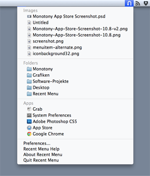

# Recent Menu

Recent Menu is a shiny little menu item, sitting around in you menu bar and showing files and folders recently accessed on your computer. Define which types of recently accessed items to show by creating custom filters for file types or filenames. Click on a menu entry to open an item, press the command key and click to show it in Finder.

Updates in Recent Menu 1.2.4:

* Fixed some compiler warnings
* Introduced Retina menu bar icon
* Fixed dark mode menu bar bug on OS X 10.10

## Features

### File Access Monitoring

The Recent Menu menu bar menu shows your recently accessed files and folders, grouped by filter categories and sorted by access time with the most recently accessed items at the top. Decide where to search and for many past hours Recent Menu should monitor recently accessed files.

### Action!

Click on any item in the menu to open it with its default application. Press the command key and click on any item in the menu to show it in Finder.

### Filtering

Group recently accessed files and folders by using one of the built-in filters (for documents, source code, PDF files, movie files, images, folders and applications), or create your own filters by filtering for filenames (e.g. *.pdf) or file types (UTI types) and use multiple filter criteria.

### For Your Convenience

Use the built-in system-wide hotkey to activate Recent Menu, no matter where you are.

